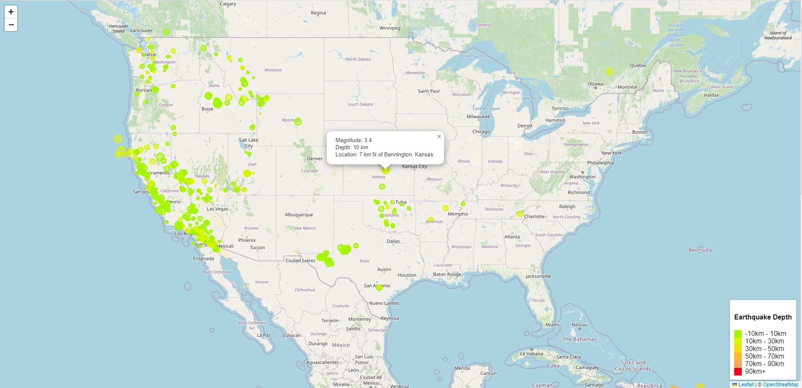

# MOD15-Leaflet-Challenge  
Student:  Jennifer Grubb  
Instructor:  Steven Greene  
Bootcamp:  DU-VIRT-DATA-PT-06-2023  
06 November 2023  

## Table of Contents
- [About](#about)
- [Contributing](#contributing)
- [Summary](#summary)
  
## About
The United States Geological Survey, or USGS for short, is responsible for providing scientific data about natural hazards, the health of our ecosystems and environment, and the impacts of climate and land-use change. Their scientists develop new methods and tools to supply timely, relevant, and useful information about the Earth and its processes.  

The USGS is interested in building a new set of tools that will allow them to visualize their earthquake data. They collect a massive amount of data from all over the world everyday, but they lack a meaningful way of displaying it. In this challenge, I have been tasked with developing a way to visualize USGS data that will allow them to better educate the public and other government organizations, and hopefully secure more funding on issues facing our planet.

## Contributing
N/A

## Summary

